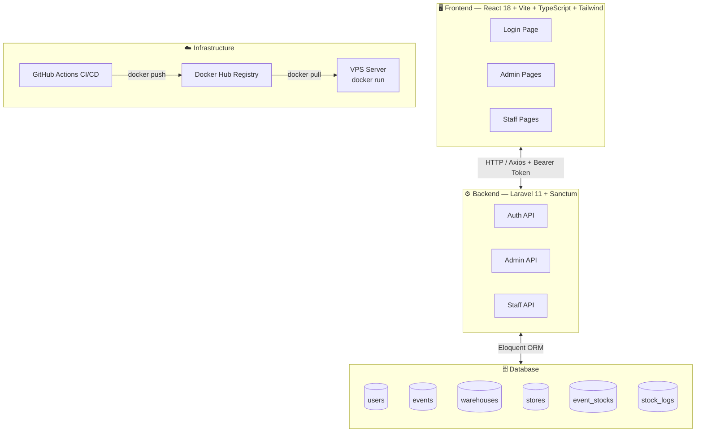
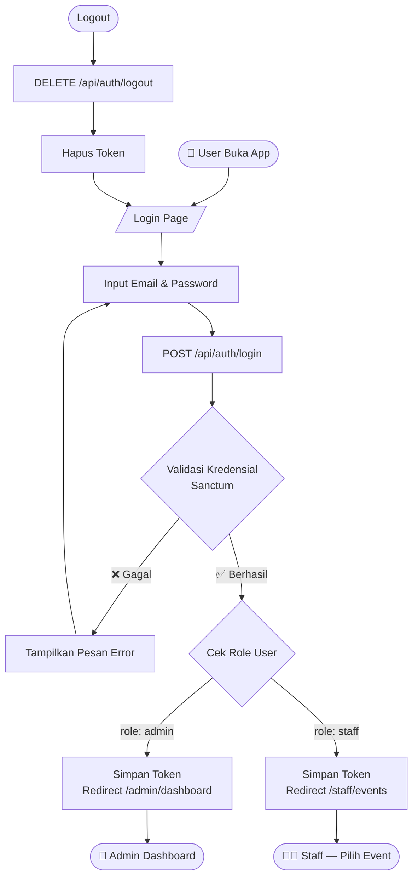
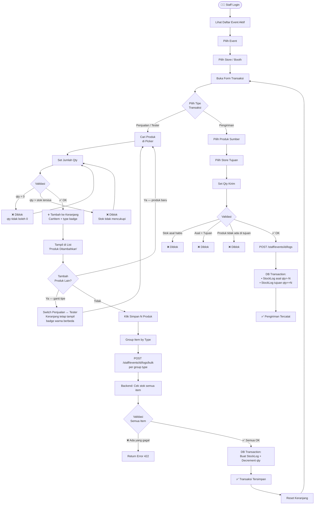
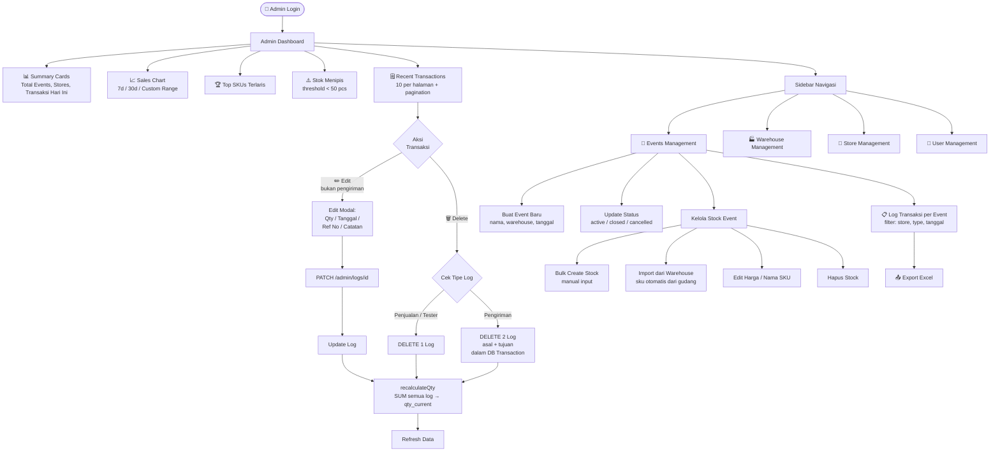
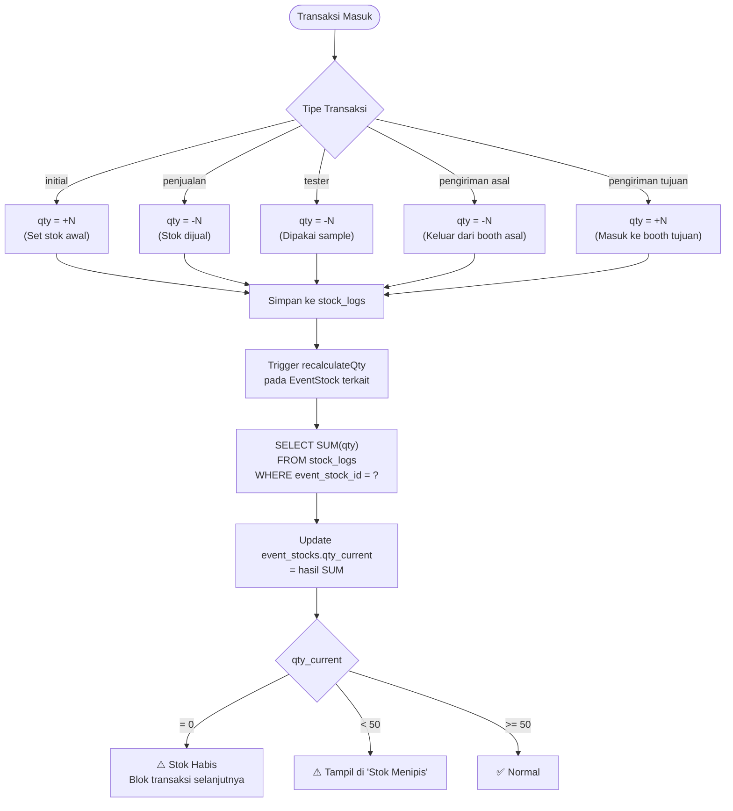
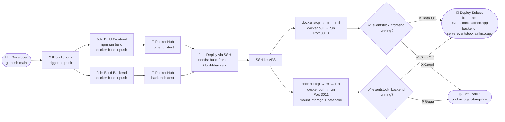

# Event Stock System — Flowchart

---

## 1. Arsitektur Sistem

---

## 2. Alur Autentikasi

---

## 3. Alur Staff — Input Transaksi

---

## 4. Alur Admin — Dashboard & Manajemen

---

## 5. Logika Perhitungan Stok

---

## 6. CI/CD Pipeline

